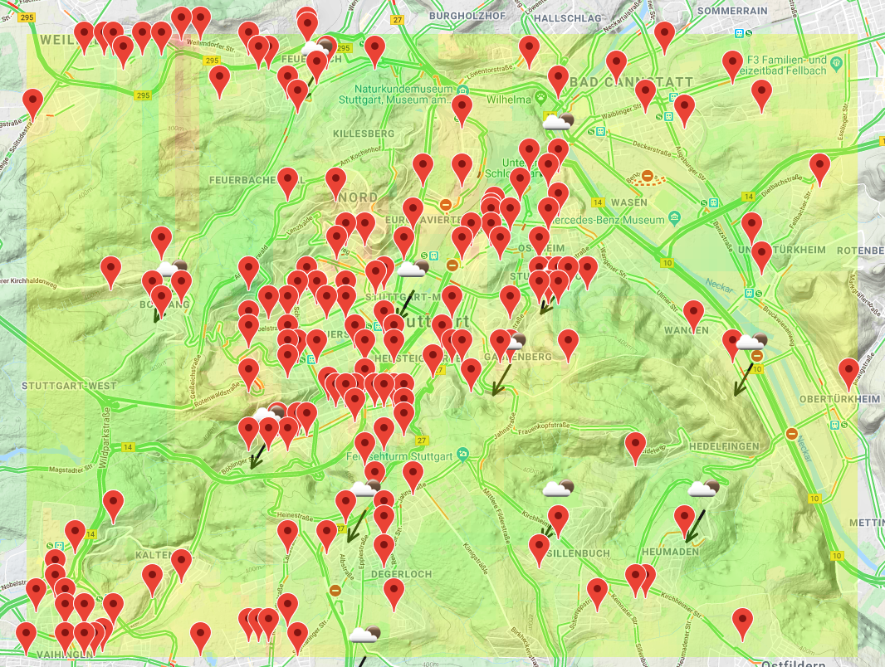

# Inhaltsvereichnis
- [Inhaltsvereichnis](#inhaltsvereichnis)
- [Einleitung](#einleitung)
- [Visuelle Analyse Luftqualität Stuttgart](#visuelle-analyse-luftqualit%c3%a4t-stuttgart)
  - [Ziel des Projekts](#ziel-des-projekts)
  - [Vorgehensweise](#vorgehensweise)
  - [Umsetzung](#umsetzung)
    - [Implementierung einer Web-Applikation in Vue.js](#implementierung-einer-web-applikation-in-vuejs)
    - [Grafischer Überblick über Datenfluss durch die Anwendung](#grafischer-%c3%9cberblick-%c3%bcber-datenfluss-durch-die-anwendung)
    - [Integration der Karten API](#integration-der-karten-api)
    - [Integration Daten APIs](#integration-daten-apis)
    - [Tile Matrix](#tile-matrix)
    - [Implementierung des Interpolations-Algorithmus](#implementierung-des-interpolations-algorithmus)
    - [Implementierung des Algorithmus zur Koordinatenübersetzung](#implementierung-des-algorithmus-zur-koordinaten%c3%bcbersetzung)
    - [Integration der Algorithmen in die restliche Anwendung](#integration-der-algorithmen-in-die-restliche-anwendung)
    - [Mitteln der Sensordaten mit Inverser Distanzwichtung](#mitteln-der-sensordaten-mit-inverser-distanzwichtung)
    - [Normalisierung und Umwandlung der Daten in Farbgradienten](#normalisierung-und-umwandlung-der-daten-in-farbgradienten)
    - [Darstellung als Layer über der Karte](#darstellung-als-layer-%c3%bcber-der-karte)
    - [UI - Elemente und Legende](#ui---elemente-und-legende)
  - [Bewertung](#bewertung)
  - [Zusammenfassung und Ausblick](#zusammenfassung-und-ausblick)
  - [Anhänge](#anh%c3%a4nge)
    - [Installation](#installation)
# Einleitung

# Visuelle Analyse Luftqualität Stuttgart
In diesem Dokument soll das Abschlussprojekt **Feinstaupp** von Felix Schick und Nicolas Mohr für das Modul Geovisualisierung im WS 19/20 vorgestellt und die verschiedenen Arbeitsschritte und Herausforderungen in der Entwicklung dokumentiert werden.

## Ziel des Projekts

Ziel des Projekts ist es eine Webapplikation zu entwickeln, welche *open source* Feinstaub- und Umweltdaten, wie Wind, Temperatur, Luftdruck und Verkehrsdichte, auf einer Karten visualisiert und eine Analyse über die mögliche Korrelation dieser zulässt.

## Vorgehensweise

Das Grundgerüst der Anwendung soll mit dem Vue.js Framework erstellt werden.
Durch sein Komponenten-basiertes Design ist das erstellen von leicht erweiterbaren Anwendungen möglich.

Als erster Meilenstein des Projekts soll mit einer Karten-API eine Karte von Stuttgart angezeigt werden.
Anschließend sollen die Umwelt- und Feinstaubdaten von APIs abgefragt werden.
Aus den erhaltenen Daten sollen verschiedenen Layer erstellt werden, die über die Karte gelegt werden können.
Diese Layer sollen die Stärke der jeweiligen Ausprägung der Daten farblich darstellen.
Durch das aktivieren von mehreren Layers wird visuell erkennbar, ob und an welchen Orten eine Korellation zwischen den verschiedenen Datenätzen besteht.


## Umsetzung

Der Code der Umsetzung ist auf [https://github.com/Qunnlin/feinstaupp](https://github.com/Qunnlin/feinstaupp) und [https://github.com/nicmr/sensor-tiles](https://github.com/nicmr/sensor-tiles) zu finden.

### Implementierung einer Web-Applikation in Vue.js

Vue.js erlaubt das Verbinden von HTML-Markup und Javascript-Code in *.vue*-Dateien.
Die Webapplikation folgt einer simplen Struktur:
Die Gesamtstruktur des Projekts wird durch die Datei *App.vue* festgelegt. Der Code, der mit der Kartenvisualisierung zu tun hat, findet sich in der Komponente *components/GoogleMap.vue*.


### Grafischer Überblick über Datenfluss durch die Anwendung


### Integration der Karten API

Als erste Karten API fasssten wir die HERE API ins Auge,
da sie über dieselbe API auch Verkehrs und Wetterdaten bietet.
Auch die Google Maps API bietet direkt über die Maps API Verkehrsdaten.
Im Vergleich stellte sich die Google Maps API aber durch umfassendere und genauere Verkehrsdaten als die bessere Alternative heraus. Auch die integrierten Wetterdaten der HERE API stellte sich nicht als Vorteil heraus, da es genug andere Quellen für bessere Daten gab.

### Integration Daten APIs


Die Integration von verschiedenen Daten-APIs erfolgt über die einen http-Request mithilfe der Javascript-Funktion *fetch* an die URL der jeweiligen API.
Dabei verwenden wir folgende Daten-APIs:

- Feinstaubdaten von *luftdaten.info*
    - Feinstaub mit einem Partikeldurchmesser von maximal 2,5 Mikrometern, *"PM10"*
    - Feinstaub mit einem Partikeldurchmesser von maximal 10 Mikrometern, *PM2.5"*
- Wettterdaten von *openweathermap.org*
    - Temperatur
    - Luftdruck
    - Luftfeuchtigkeit
    - Windgeschwindigkeit & Richtung
- Verkehrsdaten von der erwähnten Google Maps API
- Topografische Geländedaten, ebenfalls von der Google Maps API

Um Bandbreite zu sparen und nicht im nachhinein die Sensoren filtern zu müssen, fragen wir gezielt nur die Sensoren im Raum Stuttgart ab.
Die zurückgegebenen Daten enthalten stets den Messwert eines Sensors und die Koordinaten des Sensorstandorts.

### Tile Matrix

Für eine gleichmäßige Darstellung der Sensorendaten wählen wir eine Matrix aus gleichgroßen Kacheln. Diese Matrix generieren wir aus den definierten Grenzen unseres Kartenabschnittes und einer gewählten horizontalen Auflösung. Dieses Gatter spannt sich von Nord-Westen nach Süd-Osten und wird als geoJSON Objekt gespeichert um eine visualisierung zu vereinfachen.


### Implementierung des Interpolations-Algorithmus
Da sich nicht innerhalb jeder Kachel ein Sensor finden lässt begannen wir mit der Entwicklung eines Algorithmus zur Interpolation von gemittelten Sensorwerten für die Kacheln.
Für diese Aufgabe wählten wir die Sprache Purescript, die durch ihre statische Typisierung besser für das sichere Implementieren von Datenstrukturen und Algorithmen geeignet ist als Javascript. Da Purescript zu Javascript kompiliert, versprachen wir uns eine nahtlose Einbindung mit der restlichen Anwendung.
Wir entschieden uns in diesem Schritt für einen Algorithmus, der mit jeder Kachel die besten Sensorwerte aus den verschiedenen Himmelsrichtungen assoziiert.


### Implementierung des Algorithmus zur Koordinatenübersetzung

Um die Positionen der Sensoren erfolgreich auf eine zweidimensional Kachelmatrix übertragen zu können, ist ein Algorithmus zur Umrechnung von Koordinaten in Matrix-Indizes unter Beachtung der Größe des sichtbaren Kartenabschnitts und der Auflösung der Kachelmatrix erforderlich.
Auch dieser wurde in Purescript implementiert.


### Integration der Algorithmen in die restliche Anwendung

Leider war es schwieriger als erwartet, die vom Purescript-Code generierten Datenstrukturen in leserlichen Javascript-Datenstrukturen zu umzuwandeln. Die Ursache dafür liegt vermutlich an unserer geringen Erfahrung mit Purescript und dem Fehlen eines einfachen Werkzeugs zur Umwandlung von komplexen Datenstrukturen wie TreeMaps in simple Javascript Datenstrukturen.
Mit einer Funktion zum Parsen der Purescript Datenstrukturen gelang es uns dennoch, die Daten gut leserlich zur Weiterverarbeitung vorzubereiten.


### Mitteln der Sensordaten mit Inverser Distanzwichtung
Letztendlich mussten wir noch einen Algorithmus entwickeln, der die mit jeder Kachel assoziierten Sensorwerte gegeinander aufwiegt. Hierfür wählten wir die Inverse Distanzgewichtung, die wir ebenfalls in Javascript implementierten.
Der resultierenden Wert bildet den Richtwert für die Einfärbung jeder Kachel.


### Normalisierung und Umwandlung der Daten in Farbgradienten

Anschließend mussten die interpolierten Daten normalisiert und passende Farbgradienten für die Farbdarstellung als Kartenlayer berechnet werden.
Dies erforderte fachspezifische Nachforschungen für die akzeptablen Werte der verschiedenenen Messwerte. Folgende Werte wurde in einer Online-Recherche ermittelt.

 - PM10: Partikel mit einem Durchmesser von 10 Mikrometern und kleiner => Grenzwert von 50 µg/m³ [ref](https://www.allum.de/stoffe-und-ausloeser/feinstaub-und-smog/grenzwerte-richtwerte)
 - PM2.5: Partikel mit einem Durchmesser von 2.5 Mikrometern und kleiner => seit 2020 Grenzwert von 20 µg/m³ [ref](https://www.allum.de/stoffe-und-ausloeser/feinstaub-und-smog/grenzwerte-richtwerte)
 - atmosphärischer Druck: 0,950 - 0,970 bar als untere Grenze, 1,040 bis 1,080 als obere Grenze [ref](https://www.goruma.de/erde-und-natur/meteorologie/hoch-und-tiefdruckgebiete)
 - Temperatur: -10 Grad Celsius bis 40 Grad Celsius
 - Relative Luftfeuchtigkeit: 20 % relative Luftfeuchtigkeit bis 100 % relative Luftfeuchtigkeit

Mit diesem Wissen konnten wir eine Funktion implementieren, die anhand der Grenzwerte die absoluten Sensorwerte in einen pro Datenkategorie unterschiedlichen Farbverlauf einordnet.

### Darstellung als Layer über der Karte

Um die Datenmatrix als Layer über die Google Maps API darzustellen, müssen sie ins GeoJSON-Format transformiert werden.
In diesem Schritt werden auch die Indizes der Kachelmatrix wieder in Koordinaten rückübersetzt.

Anschließend können die als GeoJSON formatierten Daten an die Google Maps API übergeben werden, die diese dann als Layer rendert.


### UI - Elemente und Legende

Google Maps bietet bereits einige Elemente für das User Interface:
Zwei Buttons um den Zoom der Karte zu verändern, einen Vollbild-Button und einen "Street-View"-Button.
Außerdem lässt sich zwischen einem Karten- und Satellitenbild wechseln und die Topografische Geländevisualisierung aktivieren.

Für unsere Anwendung haben wir zusätzlich ein *Layer Control*-Element angelegt. Mit diesem können die verschiedenen Datenvisualisierungslayer (de)aktiviert werden.


Über zusätzliche Sensor-Checkboxen können die exakten Sensorpositionen der einzelnen Kategorien eingeblendet werden.




Darüber hinaus haben wir auch ein *Legend*-Element angelegt, das automatisch eine Legende zu den zum aktuellen Zeitpunkt ausgewählten Daten anzeigt.


## Bewertung

Das ursprünglich geplanten Implementieren von historischen Daten stellte sich als schwierig heraus.
Zum einen ist über die freien bzw. Studentenlizenzen der meisten APIs nur das Abfragen von aktuellen Daten oder Daten aus der unmittelbarer Vergangenheit möglich.
Das Abfragen von historischen Daten erfordert Lizenzkosten, die das Projektbudget übersteigen.
Die Wetterdaten des Deutschen Wetterdienst stehen zwar frei zur Verfügung, können jedoch nicht über eine API abgefragt werden.
Das eigenhändige Verarbeiten war uns allerdings zeitlich nicht mehr möglich.

Das Verwenden von vue.js war sehr erfolgreich, auch wenn viele der Features durch das begrenzte Scope des Projekts nicht zum Einsatz kamen. Auch das Format der .vue-Dateien und das vue-spezifische Tooling waren sehr praktisch.

Die Sprache Purescript eignete sich wie erwartet sehr gut zum Implementieren von Algorithmen. Lediglich die Exportierung von Datenstrukturen an reines Javascript war nicht ausreichend durch offizielle  Libraries unterstützt beziehungsweise dokumentiert.


## Zusammenfassung und Ausblick

Insgesamt war unser Projekt erfolgreich.

Mithilfe der Layers lässt sich visuell erkennen, welche Messwerte miteinander korellieren.
Insbesondere das Verhältnis von Verkehr und Feinstaub ist merkbar:
In den Stuttgarter Vierteln Karlshöhe und Europaviertel ist eine gleichzeitig Erhöhung von Verkehrsbelastung und Feinstaubwerten beobachtbar.

Durch die topografische Visualisierung Geländes lässt sich zu manchen Zeiten eine mögliche Korellation zwischen der "Kessellage" Stuttgarts, in der vergleichsweise erhöhte Feinstaubwerte vorliegen, und dem umgebenden Land mit tendenziell geringeren Feinstauberwerten erkennen.

Die Luftfeuchtigkeit scheint nach visuellen Eindrücken nicht mit Feinstaubwerten zu korellieren, da sowohl in Bereichen mit erhöhter Luftfeuchtigkeit wie Obertürkheim als auch in Bereichen mit niedriger Luftfeuchtigkeit wie dem Heusteigviertel.

Bei Temperatur- und Druckwerten bestehen keine bemerkbaren lokalen Unterschiede, so dass ein Einfluss auf die Feinstaubwerte erkennbar werden könnte.

Als weitere Schritte könnten durch das Sammeln von Daten über einen längeren Zeitraum auch Layer erstellt werden, die nicht nur einen Sensorwert repräsentieren, sondern den Korellationskoeffizienten zwischen mehreren Messwerten ausdrücken.
So wäre es beispielsweise möglich, die vermutete Korellation zwischen Verkehr und Feinstaub objektiver zu belegen.


## Anhänge

### Installation

Um das Projekt auf einem eigenen Server zu hosten muss zunächst das git-Repository von GitHub geklont werden.

```shell
git clone https://github.com/Qunnlin/feinstaupp.git
cd feinstaupp
```
Danach müssen die benötigten dependencies via npm installiert werden

```shell
npm install
```

Das Projekt kann dann entweder direkt für einen development Server kompiliert und gehostet werden

```shell
npm run serve
```

Oder für die Produktion kompiliert werden
```shell
npm run build
```
